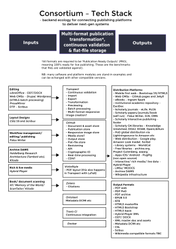


  * [{{ repository.name }}]({{ repository.html_url }})


{
    "versions": {
        "jekyll": <version>,
        "kramdown": <version>,
        "liquid": <version>,
        "maruku": <version>,
        "rdiscount": <version>,
        "redcarpet": <version>,
        "RedCloth": <version>,
        "jemoji": <version>,
        "jekyll-mentions": <version>,
        "jekyll-redirect-from": <version>,
        "jekyll-sitemap": <version>,
        "github-pages": <version>,
        "ruby": <version>"
    },
    "hostname": "github.com",
    "pages_hostname": "github.io",
    "api_url": "https://api.github.com",
    "environment": "dotcom",
    "public_repositories": [ Repository Objects ],
    "organization_members": [ User Objects ],
    "build_revision": "cbd866ebf142088896cbe71422b949de7f864bce",
    "project_title": "metadata-example",
    "project_tagline": "A GitHub Pages site to showcase repository metadata",
    "owner_name": "github",
    "owner_url": "https://github.com/github",
    "owner_gravatar_url": "https://github.com/github.png",
    "repository_url": "https://github.com/github/metadata-example",
    "repository_nwo": "github/metadata-example",
    "repository_name": "metadata-example",
    "zip_url": "https://github.com/github/metadata-example/zipball/gh-pages",
    "tar_url": "https://github.com/github/metadata-example/tarball/gh-pages",
    "clone_url": "https://github.com/github/metadata-example.git",
    "releases_url": "https://github.com/github/metadata-example/releases",
    "issues_url": "https://github.com/github/metadata-example/issues",
    "wiki_url": "https://github.com/github/metadata-example/wiki",
    "language": null,
    "is_user_page": false,
    "is_project_page": true,
    "show_downloads": true,
    "url": "http://username.github.io/metadata-example", // (or the CNAME)
    "contributors": [ User Objects ],
    "releases": [ Release Objects ]

}

The consortium’s mission is to support software development communities to build free and open source publishing infrastructures.

The consortium is a network of businesses, community groups and researchers.

The consortium’s activities include; research and research publishing, software development, business development, advocacy, publishing, events and peer-learning.

The consortium is open to all areas of publishing. The current priority is interoperability between software platforms in scholarly publishing that are using multi-format and multimedia functionality.

The consortium is operated by the research organization the [Hybrid Publishing Group](https://hpg.io/).

### Connecting Platforms

The consortium supports an infrastructural backend software ecology to connect publishing platforms to enable — continuous validation, real-time processing, multi-format outputs and multimedia features.
 
The objective is to promote design excellence in — authoring systems, publication layout and interface design, librarianship and engineering — to enable diverse and global communities in the pursuit of knowledge creation and dissemination.

Key to the infrastructural approach is a notion of a universal fluid document model based on format transformation aligned to output requirements, rather than fixed format standards. The fluid document model is then combined with a test-driven methodology combining continuous validation and technologies including real-time processing, cryptographic IDs, flat-file storage, Docker virtualisation, encrypted documents and content distribution network APIs.

The goal of the infrastructure is to create a new synthesis of computational automation and human skills and agency, adding next-gen reliability and speed to publication production. In turn this new synthesis will change the use and control of knowledge institutions and industries.

Consortium Tech Stack [PDF version](https://github.com/consortium/Hybrid-Publishing-Consortium/blob/master/pdf/consortium-v04.pdf)

### Getting Involved
Find us on [GitHub](https://github.com/consortium), or follow us in Twitter [pub_con](https://twitter.com/pub_con)

### Members Include
Le-Tex Publishing Services GmbH, Fidus Writer, AVCO Limited, Hybrid Publishing Group, InfoMesh Technologies UG, Small Museums (Canada), xm:lab - Experimental Media Lab (HBKsaar, DE) and Center for Disruptive Media (Coventry University, UK), Mute Publishing.

### Info
Contact: Simon Worthington, simon AT hpg.io [Imprint](imprint.md) © 2011-2017 The authors. Creative Commons, Attribution-ShareAlike 4.0 International
